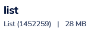

### Start redis db and Redis Insight in docker


### Preparing dataset
All steps are in `main.py`

Download json from (warning! 25MB) [link](https://raw.githubusercontent.com/json-iterator/test-data/master/large-file.json).

Convert to different structs:
```
filename = "./large-file.json"

with open(filename, 'r', encoding='utf8') as json_file:
    large_json = json.load(json_file)
    large_string = json.dumps(large_json)
    large_list = large_string.split(' ')
    large_set = set(large_list)
    nums = np.linspace(0, len(large_list) - 1, num=len(large_list) - 1)
    large_zset = {large_list[int(n)]: int(n) for n in nums}
```

### Upload dataset to redis

```
rdb = redis.Redis(host='localhost', port=6379)

rdb.set('str', large_string)

for elem in large_list:
    rdb.rpush('list', elem)

rdb.sadd('hset', *large_set)
rdb.zadd('zset', large_zset)
```




### Measure time

Get execution time off all commands:
```
start = time.time()
# your command goes here
end = time.time()
print(end - start)
```
Results:
```
lrange 0-5000: 0.01ms
String append 0.00ms
Set sismember 0.00ms
Set sadd 0.00ms
List push 6000 0.01ms
Zrange 6000 0.01ms
delete 0.08ms
```

### Setup redis cluster in docker (Linux only)
All steps are in `redis_cluster.py`

For 6 instances we will create 6 folders with configs:
```
mkdir 7001 7002 7003 7004 7005 7006
```

For each folder create `redis.conf` file:
```
port <port>
cluster-enabled yes 
cluster-config-file nodes.conf 
cluster-node-timeout 5000 
append-only yes 
bind 127.0.0.1
```

And `create_cluster.sh` script:
```
redis-cli --cluster create 127.0.0.1:7001 \
                           127.0.0.1:7002 \
                           127.0.0.1:7003 \
                           127.0.0.1:7004 \
                           127.0.0.1:7005 \
                           127.0.0.1:7006 \
                            --cluster-replicas 1
```

Start all 6 containers and connect to host network (Linux only)
```
docker run -v ./<7001-7006>/redis.conf:/usr/local/etc/redis/redis.conf -d --net=host --name server-0 redis redis-server /usr/local/etc/redis/redis.conf
```


And run `create_cluster.sh` on one of the nodes


